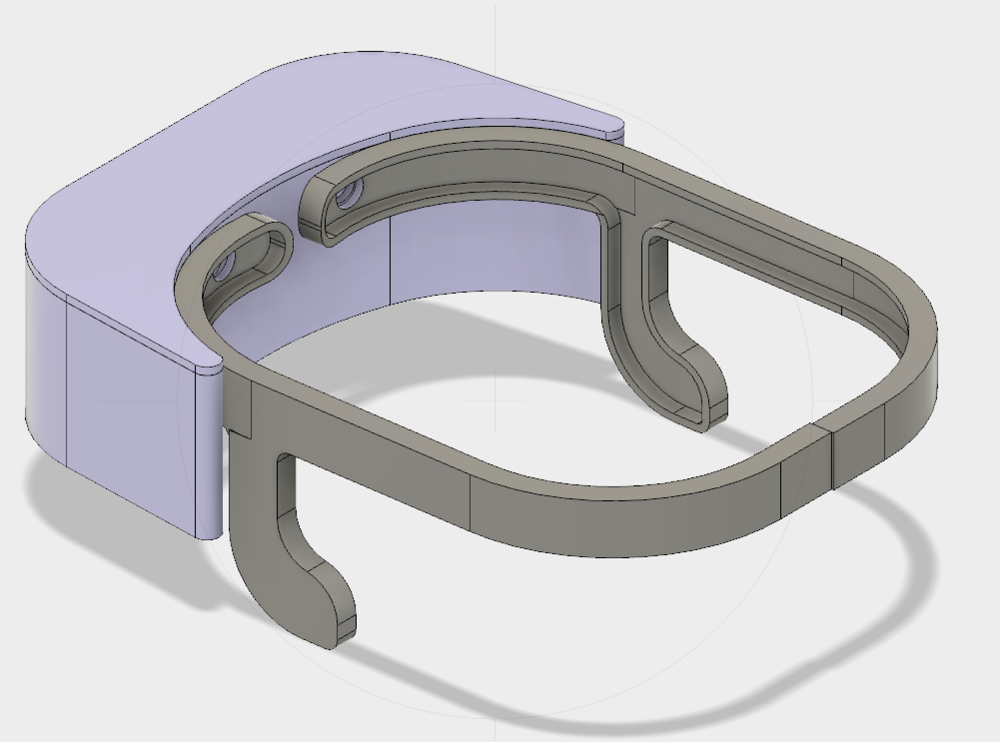

# Mind Reader

### Video

[](https://www.youtube.com/watch?v=uhK6hbT17xc) 
</br>
https://www.youtube.com/watch?v=uhK6hbT17xc

## Deployment

The main focus of this project is to create a platform for simple use, high quality and mobile egg technology. The headset is able to detect electrical signals in the brain (via electroencephalography, or EEG) as well as muscular movements (electromyography, or EMG), both well known in the medical community. Once you have those signals, the real magic begins, which is the ability to map signals to different actions. By doing so, the user is effectively teaching the machine how to read a specific mind.

The next step is mapping specific thoughts to specific actions, analogous to programming a universal remote control. The key here is that the thought and action don't necessarily have to be the same.

Any device can take the headset data and create an action based on the prediction. We are using a iOS application to prove this concept.

### Prerequisites

```
python 2.7
node V8.0.0
xcode 9.0+
```

### Installing

```
Pip install requirement.txt
```


## Getting Started


Main file in /eegCommLayer is sequence_mgmt.js which can be run with Node’s V8 JavaScript Engine. This file is a sequencer that makes multiple other file calls and hosts many subprocesses to communicate with the EEG Headset as well as the companion app. This sequence engine is run on dedicated hardware along with the necessary packages, extensive knowledge of platform is required to manually run engine. Once engine is started with is by default on power up of hardware, all UI controls take place through mobile application.

To build the companion app /SwiftApp XCode 9.0 + is required. Along with Cocoa Pods installed in XCode project root directory.

## Mobile App Splashscreen

https://appsite.skygear.io/eegmindreader/

## Design

### Headset
<p align="center">
  
</p>

### State Machine

```
              Firebase
             /        \
            /          \ 
           /            \
State   iOS App        Headset
-----   -------        -------
0        Idle            NC
1        Login           NC
2        Train          Connecting
3       TrainOne        Collecting Data for One
4       TrainTwo        Collecting Data for Two
5         Idle          Creating model
6     Showing Output    Running data through model(Real-time)

```

### Running the tests

If you not already connected to the iOS application you can test using test script. This script acts as if you are triggering the flags to train data and make decisions.

```
node test_firebase.js
```
Execute this command in parallel will running the firebase test script or using the iOS app.

```
node sequence_mgmt.js
```

## Versioning
1.0

## Authors

Sara Sepasian,
Amir Jabbari,
Mohdi Habibi,
Taylor Keairns


## Acknowledgments

* Thanks to professor Preet Kang for all his support and time


