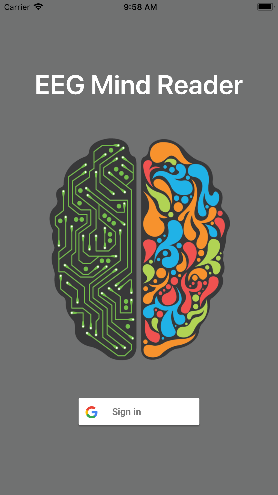
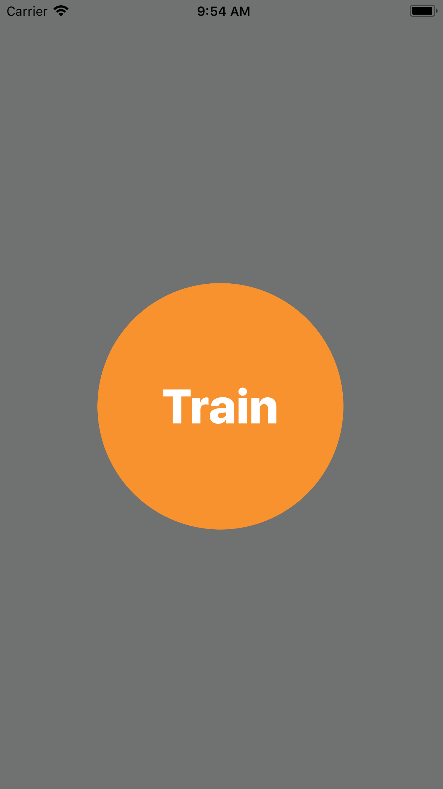
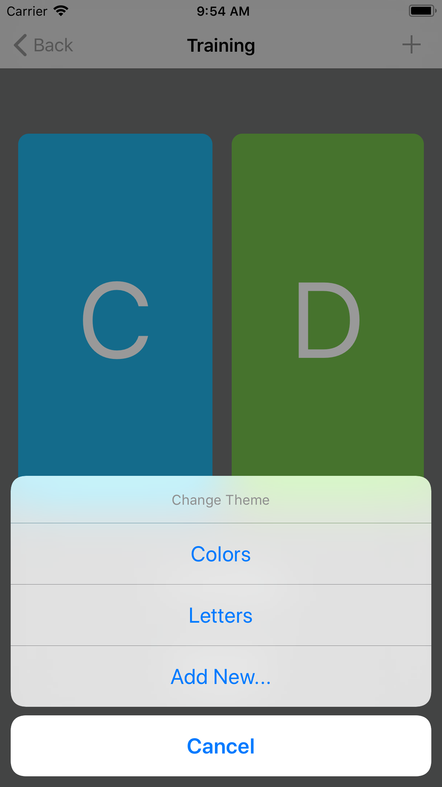
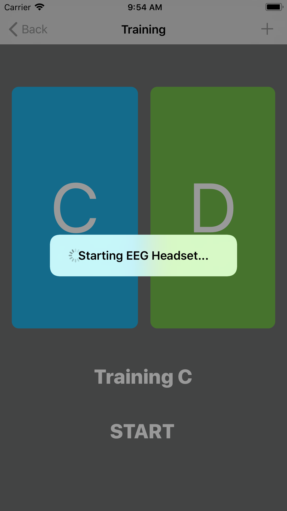
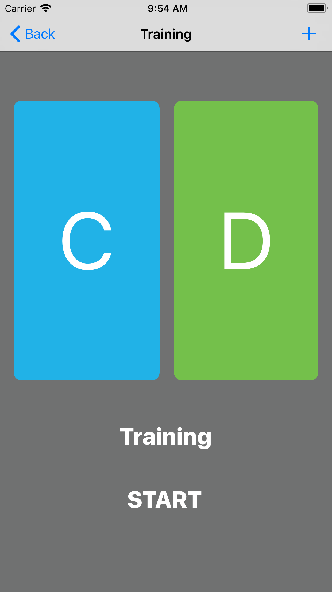
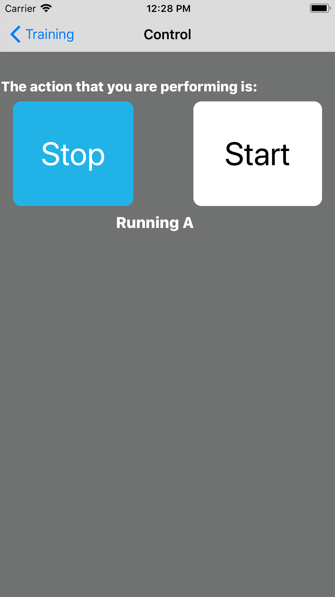

### Companion Swift Application to EEGMindReader Project

Enables the training and creation of machine learning model on the headset. As well as real time visualization of predictions through classification of the model.

### Splashscreen:

https://appsite.skygear.io/eegmindreader/

### Screenshots:

<p align="center">
  
  
  </br>
  
  
  
</p>
	
### Features:

```
Firebase
Google Login
Swift 3
```
### Dependencies:

```
Cocoa Pods:
	Firebase/Core
	Firebase/Database
	GoogleSignIn
```

